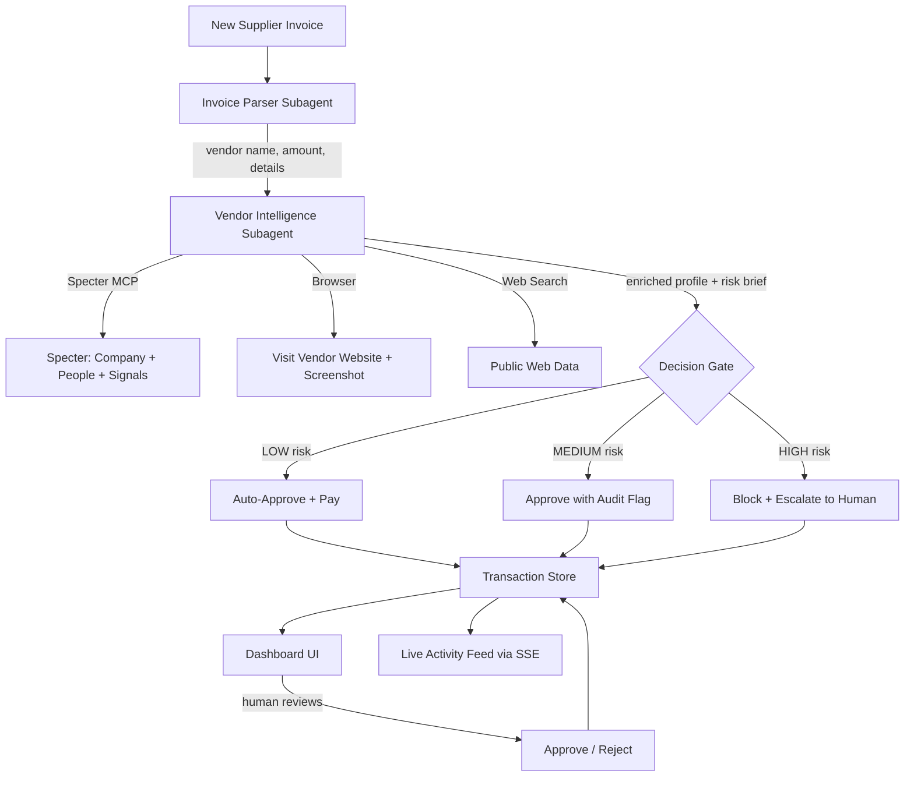

# Supplier Onboarding + First Payment Agent

## The Idea

**One sentence:** "Drop in a new supplier invoice, and the agent does the due diligence that takes your team an hour — then pays or escalates in seconds."

**The human job we're killing:** When a new vendor sends a company its first invoice, someone in finance/procurement has to:
1. Google the company — are they real?
2. Check who runs it — are they credible?
3. Visit their website — does it look legitimate?
4. Verify company details match the invoice
5. Assess risk — shell company? too new? mismatch?
6. Write up a brief for the approval chain
7. Approve or escalate the first payment

This takes **30-60 minutes per vendor**. Mid-size companies onboard dozens of new suppliers per month. It's tedious, high-stakes, and error-prone.

**Our agent does all of this in seconds, using real data from Specter, live browser verification, and analyst-grade risk briefs.**

---

## What Makes It Unique

1. **Analyst-grade risk briefs** — not just "risk: HIGH" but a full written brief like a human analyst would produce: "This company was founded 2 months ago, has 3 employees, no funding, and the CEO has no LinkedIn presence. The invoice is for £12,000 in consulting. Recommendation: block."

2. **Live browser verification** — the agent uses Cursor's browser tool to visit the vendor's website, take a screenshot, and assess if it looks like a real business. This goes beyond API data.

3. **Evolving vendor trust** — vendors get a trust score that persists. Second invoice from the same vendor? Trust is already higher. The system learns.

4. **Cross-invoice pattern awareness** — the agent notices patterns across invoices: "Three new vendors this week, all registered in the same month, similar amounts. Possible coordinated fraud."

5. **Live activity feed** — while the agent works, you see every step happening in real-time: "Querying Specter... Found company... Checking key people... Visiting website... Writing risk brief..."

---

## Architecture



### Two Subagents (Cursor SDK)

- **Invoice Parser** (fast model, e.g. composer-2) — extracts vendor name, amount, currency, line items, due date, vendor address/domain from the invoice text. Pure extraction, no judgment.

- **Vendor Intelligence Agent** (reasoning model, e.g. claude-4-sonnet-thinking) — single agent that does BOTH research and risk assessment in one pass with full context. Uses 5-layer enrichment:

### 5-Layer Enrichment Pipeline

| Layer | Source | What it adds | How |
|-------|--------|-------------|-----|
| 1 | **Invoice itself** | Vendor name, amount, line items, domain | Extracted by Invoice Parser subagent |
| 2 | **Specter: Company** | Company profile, funding, employees, growth stage, operating status, highlights | `GET /companies/search?query={name}` then `GET /companies/{id}` |
| 3 | **Specter: People** | CEO/founders, titles, seniority, departments | `GET /companies/{id}/people?ceo=true&founders=true` |
| 4 | **Web search** | Recent news, red flags, public reputation, lawsuits, complaints | Cursor agent built-in web search tool |
| 5 | **Browser visit** | Website screenshot, visual legitimacy check (real site vs parked domain) | Cursor agent built-in browser tool — visits vendor domain |

After gathering all 5 layers, the Vendor Intelligence Agent:
- Synthesizes everything into an **analyst-grade risk brief** (written like a human due diligence report)
- Produces a **structured risk score** with threshold triggers
- Makes a **decision recommendation** (auto-pay / flag / block)

### Specter API Calls (confirmed working)

| Endpoint | Purpose | Credits |
|----------|---------|---------|
| `GET /companies/search?query={vendor_name}` | Find company by name, get Specter ID | 1 |
| `GET /companies/{id}` | Full profile: funding, employees, growth stage, highlights, operating status, web metrics, socials, news, reviews | 1 |
| `GET /companies/{id}/people?ceo=true&founders=true` | Key people: names, titles, seniority, departments | 1 |
| `POST /entities/text-search` | (optional) Extract company references from invoice text | 1 |

**Base URL:** `https://app.tryspecter.com/api/v1`
**Auth:** `X-API-KEY` header
**Cost:** ~3 credits per invoice processed

### Key Specter Data Fields for Risk Assessment

From the company profile we get:
- `founded_year` — how old is this company?
- `employee_count` / `employee_count_range` — how big?
- `growth_stage` — bootstrapped / seed / early / growth / late / exit
- `funding.total_funding_usd` — how much funding?
- `funding.last_funding_date` — when was last funding?
- `operating_status` — active / acquired / closed / ipo
- `highlights` — headcount_surge, strong_growth, top_tier_investors, etc.
- `website.domain` — do they have a real website?
- `founder_info` — who founded it, their titles
- `investors` — who invested in them?
- `news` — recent press coverage
- `reviews` (G2, Trustpilot, Glassdoor) — public reputation
- `traction_metrics` — web visits, employee growth over time

### Human-in-the-Loop Design

| Risk Level | Criteria | Action |
|------------|----------|--------|
| LOW | Funded company, verified people, amount under £2,000, website looks real | Auto-approve + execute payment |
| MEDIUM | Company exists but young/small, moderate amount, or minor flags | Approve with audit flag visible |
| HIGH | Can't verify company, no Specter data, no website, suspicious signals, amount over £5,000 from unknown | Block payment + escalate to human |

The agent always shows its reasoning. The human reviewer sees the full risk brief, Specter data, website screenshot, and can approve or reject with one click.

---

## Tech Stack

- **Next.js 14** (App Router) — dashboard UI + API routes + SSE endpoint
- **Cursor SDK** (`@cursor/sdk`) — orchestrates 2 subagents programmatically
- **Specter MCP** — plugged into the agent for vendor intelligence
- **Server-Sent Events (SSE)** — streams live activity to the dashboard
- **In-memory store** — invoices, vendor trust scores, transaction history, activity log
- **Mock payment layer** — simulated payment execution with transaction logging

---

## Live Activity Feed

While the agent processes an invoice, the dashboard shows a real-time activity stream:

```
[18:42:01] Received invoice #INV-2026-042 from NovaTech Solutions (£3,200)
[18:42:02] Parsing invoice... extracted vendor: NovaTech Solutions, amount: £3,200.00
[18:42:03] Querying Specter for company data...
[18:42:05] Specter: Found NovaTech Solutions — Founded 2021, 45 employees, Seed funded
[18:42:06] Looking up key people via Specter...
[18:42:07] Found CEO: James Chen (prev. Senior Engineer at Stripe)
[18:42:08] Visiting https://novatech.io — taking screenshot...
[18:42:10] Website verified: professional site, matches company description
[18:42:11] Checking cross-invoice patterns... no anomalies detected
[18:42:12] Writing risk brief...
[18:42:14] DECISION: MEDIUM risk (score: 0.45) — Approved with audit flag
[18:42:14] Reason: Company is young (2021) but funded, CEO has strong background.
           Amount (£3,200) exceeds auto-pay threshold (£2,000) for Seed-stage companies.
[18:42:15] Payment flagged for audit. Awaiting human review if needed.
```

This is streamed via SSE so it appears live in the UI — the user watches the agent think.

---

## Dashboard Pages

### Main Dashboard
- **Invoice Queue** — drop in new invoices or pick from seed data
- **Live Activity Feed** — real-time stream of agent actions (collapsible, can run in background)
- **Active Processes** — invoices currently being analyzed, with progress indicators
- **Recent Decisions** — latest completed assessments with status badges (auto-paid / flagged / blocked)

### Invoice Detail View (click to expand)
- **Invoice Info** — amount, vendor, line items, due date
- **Vendor Profile Card** — Specter-enriched data: company info, funding, employees, key people
- **Website Screenshot** — browser capture of vendor's site
- **Risk Brief** — full analyst-style writeup
- **Risk Score** — visual gauge with threshold markers
- **Action Buttons** — Approve / Reject (for flagged/blocked invoices)

### History View
- **All Processed Invoices** — searchable/filterable table
- **Vendor Trust Scores** — list of known vendors with their evolving trust level
- **Patterns Detected** — any cross-invoice anomalies flagged

---

## File Structure

```
/
  package.json
  tsconfig.json
  .env.local                          # CURSOR_API_KEY, SPECTER_API_KEY
  .cursor/mcp.json                    # Specter MCP config
  src/
    app/
      layout.tsx                      # Root layout with global styles
      page.tsx                        # Main dashboard page
      history/
        page.tsx                      # Processing history page
      api/
        process-invoice/
          route.ts                    # POST: triggers agent pipeline for an invoice
        approve-payment/
          route.ts                    # POST: human approves/rejects a flagged payment
        invoices/
          route.ts                    # GET: list all invoices and their status
        activity-stream/
          route.ts                    # GET: SSE endpoint for live activity feed
    lib/
      agent.ts                        # Cursor SDK agent setup + 2 subagent definitions
      pipeline.ts                     # Orchestration: parse -> research+assess -> decide -> pay
      mock-payment.ts                 # Simulated payment execution
      store.ts                        # In-memory store: invoices, vendors, transactions, activity log
      events.ts                       # Event emitter for SSE activity streaming
      types.ts                        # All TypeScript types
    components/
      Dashboard.tsx                   # Main dashboard layout
      InvoiceQueue.tsx                # Invoice list + submit new invoice
      InvoiceDetail.tsx               # Expanded invoice view with vendor profile + risk brief
      ActivityFeed.tsx                # Real-time activity stream (SSE consumer)
      VendorProfile.tsx               # Specter-enriched vendor card
      RiskBrief.tsx                   # Analyst-style risk writeup
      RiskGauge.tsx                   # Visual risk score gauge
      PaymentActions.tsx              # Approve/reject buttons for human review
      StatusBadge.tsx                 # Auto-paid / Flagged / Blocked badges
      HistoryTable.tsx                # Searchable table of past decisions
    data/
      seed-invoices.json              # 5 test invoices with varied risk profiles
```

---

## Seed Invoices (5 scenarios)

| # | Vendor | Amount | Expected Outcome | Why |
|---|--------|--------|-------------------|-----|
| 1 | Synthesia (real, Series C, 300+ employees) | £800 | AUTO-APPROVED | Known funded company, small amount, strong Specter data |
| 2 | A clearly suspicious made-up entity | £15,000 | BLOCKED + ESCALATED | No Specter data, no website, high amount |
| 3 | A real small startup (Seed stage, 10 people) | £3,200 | FLAGGED (medium risk) | Exists but young, moderate amount above auto-pay for small companies |
| 4 | A real established company (e.g. Wise, Stripe) | £4,500 | AUTO-APPROVED | Well-known, highly funded, strong Specter profile |
| 5 | A real company but with a suspicious invoice pattern | £2,800 | FLAGGED (medium risk) | Company is real but amount/pattern doesn't match their typical services |

---

## Build Order

1. **Scaffold** — Next.js project, install deps (`@cursor/sdk`, etc.), env setup, `.cursor/mcp.json`
2. **Types + Store** — Define all TypeScript types, create in-memory store with event emitter for SSE
3. **Seed data** — Create 5 test invoices in JSON
4. **Agent setup** — Configure Cursor SDK agent with Specter MCP, define 2 subagents (parser + vendor intelligence)
5. **Pipeline** — Build orchestration: parse -> research+assess -> decision gate -> mock payment
6. **Mock payment** — Payment execution simulation + transaction log + vendor trust updates
7. **API routes** — process-invoice, approve-payment, invoices list, SSE activity stream
8. **Dashboard UI** — Invoice queue, live activity feed, vendor cards, risk briefs, approve/reject, history
9. **Polish** — Loading animations, real-time streaming, responsive layout, status badges
10. **Test everything** — End-to-end: submit all 5 invoices, verify pipeline, SSE, human review flow, history

---

## Final Sanity Check — All 10 Points

### Concrete Workflow Value (2 pts) -- PASS
- **Job replaced:** AP/procurement analyst doing new vendor due diligence (30-60 min per vendor)
- **End-to-end:** Agent parses invoice, enriches vendor (5 layers), writes risk brief, decides, pays or escalates
- **Time saved:** 30-60 min becomes ~30-60 seconds. Timer shown in demo.
- **Real workflow:** Every company with suppliers does this. Recognizable to any finance/VC judge.

### Track Fit — Money Movement (2 pts) -- PASS
- **Moves money:** Mock payment executes (approve/block). The entire pipeline ends in a payment decision.
- **Core action:** "Should we pay this vendor for the first time?" Pure money movement.
- **Risk is direct:** Approve a fraudulent vendor = money gone. Demo shows a suspicious vendor getting blocked.

### Human-in-the-Loop (1 pt) -- PASS
- **Thresholds:** Amount (£2K auto-pay limit), company age, funding status, Specter data availability
- **Automatic for low-risk:** Funded company + small amount + verified people = auto-pay
- **Escalation for high-risk:** Unknown company + no Specter data + high amount = blocked
- **Reasoning visible:** Risk brief explains WHY. Dashboard shows full Specter data + web findings.
- **Edge case:** No Specter data = auto-escalate to HIGH. Agent uncertain = escalate.

### Technical Execution (1 pt) -- PASS
- **Clean architecture:** 2 subagents, typed interfaces, SSE streaming, in-memory store, mock payment layer
- **Integrations work:** Specter API confirmed working (tested search, returns real data)
- **Latency:** Invoice parsing fast (composer-2). Vendor research is the bottleneck but streams progress via SSE.
- **Error handling:** No Specter data = auto-escalate. Browser fails = flag. Graceful degradation.

### Demo Clarity (1 pt) -- PASS
- **90-sec script:** 5 invoices, 3 different outcomes, clear narrative
- **One sentence:** "This agent replaces your AP analyst — it onboards new vendors and approves or blocks their first payment in seconds."
- **Visual UI:** Dashboard with live activity feed, vendor cards, risk briefs, status badges
- **Wow moment:** First 15 sec — drop invoice, agent starts researching live, Specter data populates, browser screenshot appears

### Best use of Cursor (+1) -- PASS
- **SDK programmatic:** Cursor SDK orchestrates 2 subagents from TypeScript
- **Deployable:** API route + SDK = could run as a service
- **Subagents:** Invoice parser + vendor intelligence agent
- **Built-in tools used:** Browser (website verification), web search (news/red flags), MCP (Specter)
- **Functional:** The SDK IS the runtime. Remove it and nothing works.

### Best use of Specter (+1) -- PASS
- **Connected:** Specter REST API via direct calls (search, company details, people). MCP if available.
- **Drives decisions:** Specter data is PRIMARY input to risk score. No data = auto-escalate.
- **Multiple capabilities:** Company enrichment + people lookup + growth signals + news + traction metrics
- **Can't work without it:** Without Specter, agent is blind. With it, full company intelligence.
- **Changes outcome:** Demo shows vendor that looked fine from invoice, but Specter reveals founded 2 weeks ago = BLOCKED.

### Best use of LLM models (+1) -- PASS
- **Multi-model:** Fast model (composer-2) for parsing. Reasoning model (claude-4-sonnet-thinking) for risk assessment.
- **Intentional:** "Parsing is simple extraction. Risk assessment needs to weigh conflicting signals across 5 data layers."
- **Structured outputs:** Risk assessment returns JSON: `{ riskLevel, score, reasoning, recommendation, thresholds_triggered }`
- **Confidence affects flow:** Model confidence maps to LOW/MEDIUM/HIGH tiers.

**Total: 7 core + 3 bonus = 10/10 coverage. All criteria addressed.**
